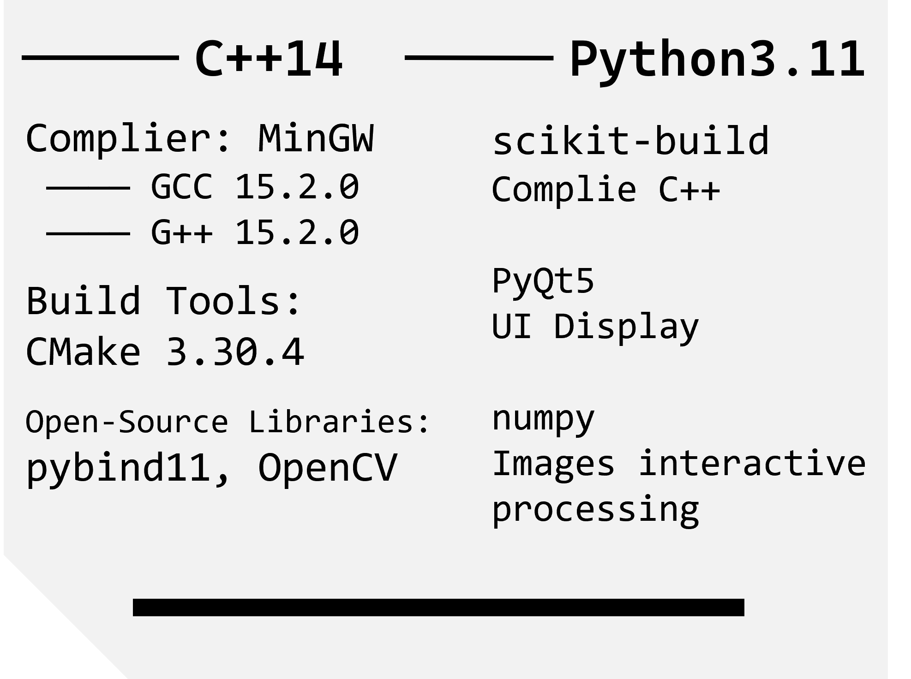
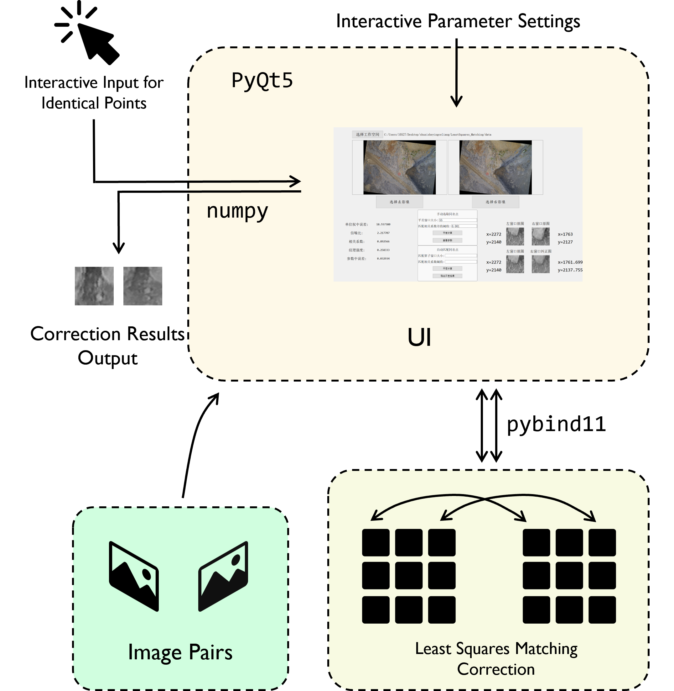
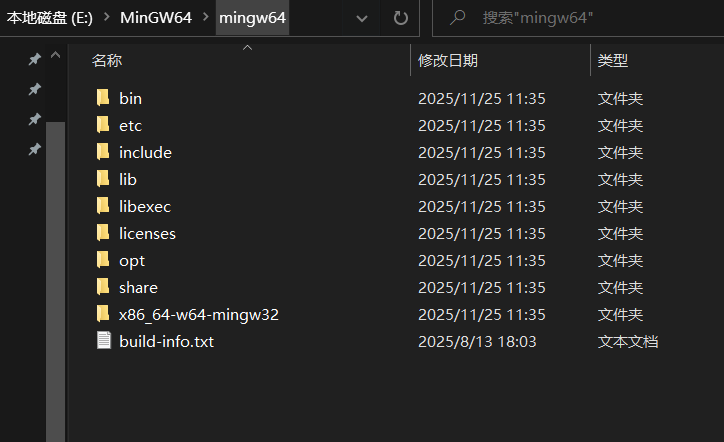
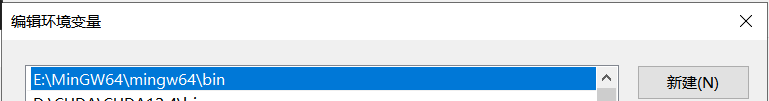
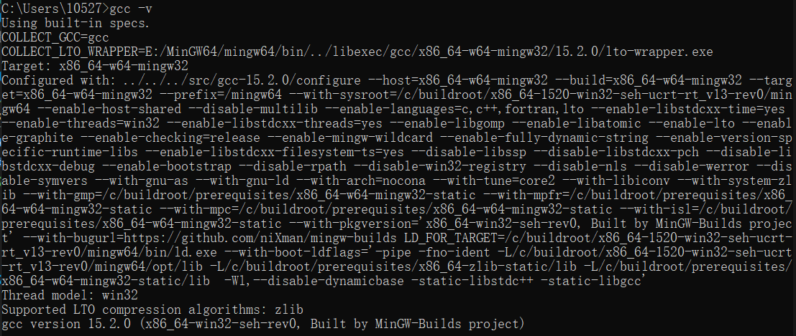
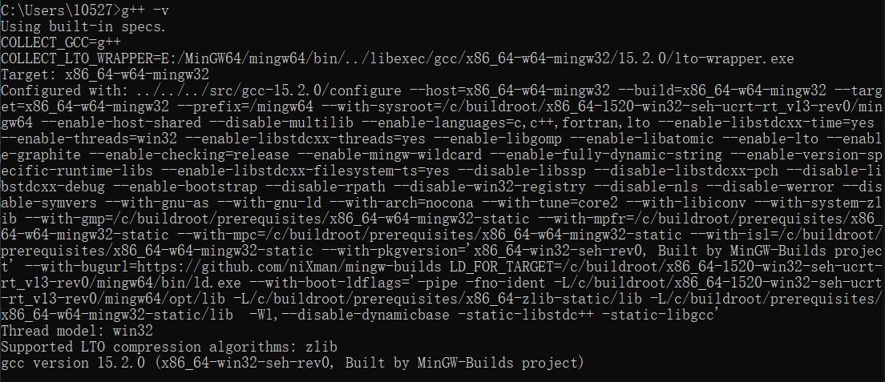
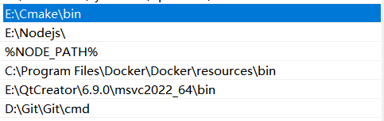

# Least-Square Matching for Image Pairs
[](https://github.com/DonaldTrump-coder/LeastSquares_Matching/)
[](https://github.com/DonaldTrump-coder/LeastSquares_Matching/)
[](http://www.apache.org/licenses/)
<br>
A project of the Least-Square Matching Algorithm for Image Pairs in window-size areas. We provide the source code in C++ and a python library build upon it.<br>
Up to now we have successfully tested the C++ and Python on Windows 10 and Windows 11.<br><br>
Contributor links: [Haojun Tang](https://donaldtrump-coder.github.io/), [Jiahao Zhou](https://github.com/Jeiluo)

## About the Project
### Environment


### Structure


## Core Algorithm tested in C++
### Windows
**1. Download Release for MinGW-w64**<br>
Click [here](https://github.com/niXman/mingw-builds-binaries/releases/download/15.2.0-rt_v13-rev0/x86_64-15.2.0-release-win32-seh-ucrt-rt_v13-rev0.7z) to download the release of `MinGW-W64 v13`.<br>
Unzip it and place it on any place of your hard drive. Like <br>
Configure the environment variables to include the MinGW-w64 path `mingw64\bin`. Like <br>
In CMD, enter `gcc -v` and `g++ -v`.
<p>If you get  and , then the installation is finished.
</p>

**2. Install CMake for Windows**<br>
Get the CMake installer for Windows [here](https://github.com/Kitware/CMake/releases/download/v4.2.0/cmake-4.2.0-windows-x86_64.msi) and install it under its guidance.<br>
You also need to make sure its path `Cmake\bin` is a member of the environment variables. Like <br>
In CMD, enter `cmake --version`, if you get the version of CMake, the installation is finished.<br><br>
**3. Build for the Code**<br>
In the project directory, run the following commands:<br>
```
mkdir build
cd build
cmake .. -G "MinGW Makefiles"
mingw32-make -j8
.\leastsquares_matching.exe
```
The output is from the main function in `core\src\test.cpp`

## Image Matching Application Deployment
### Windows
You also need MinGW-w64 and CMake. Install them as mentioned above!<br><br>
**1. Install the Requirement Packages for Python**<br>
In the project directory, run<br>
```
conda create -n matching python=3.11
conda activate matching
pip install -r requirements.txt
```

**2. Build the C++ Source for Application**<br>
```
cd python
python setup.py bdist_wheel
pip install dist\lsmatching-0.0.1-cp311-cp311-win_amd64.whl --force-reinstall
cd ..
```
Then the install of C++ Source of Least-Square Matching is done.<br><br>
**3. Use the Application in Python**<br>
run
```
python main.py
```

## Citation
If you use this project in your research, please cite:
```bibtex
@misc{LSMTang2025,
  title        = {Least-Square Matching for Image Pairs},
  author       = {Haojun Tang and Jiahao Zhou},
  year         = {2025},
  publisher    = {GitHub},
  journal      = {GitHub repository},
  howpublished = {\url{https://github.com/DonaldTrump-coder/LeastSquares_Matching}},
  note         = {Apache License 2.0}
}
```
